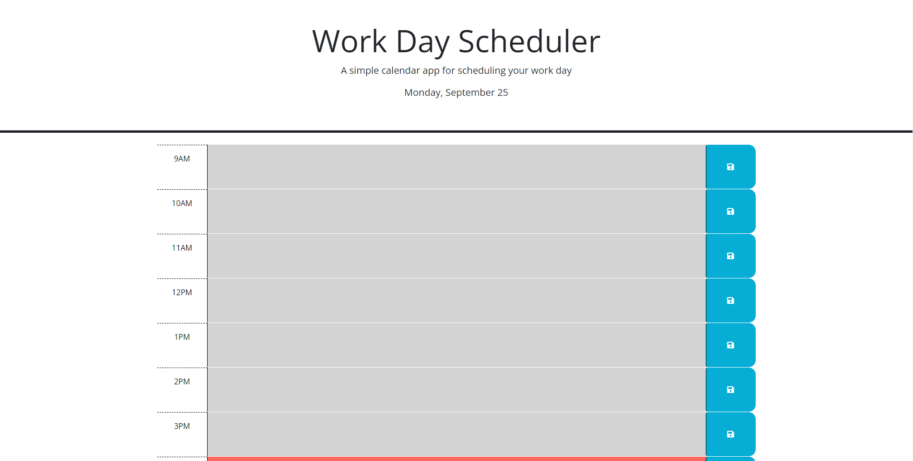

# WeekFiveChallenge_WorkScheduler

## Description

My motivation for this project was to understand how jquery, Javascript, dayjs, and bootstrap are used together to make websites. I built this project to help me get experience with working with dayjs and jquery. This project solves the problem of helping organize a busy work schedule. I learned from making this project was how to use jquery and dayjs to create a website.

## Usage

You can use the website to save specific events or things that you need to do to a time slot by hitting the save button.

Link to webpage: (https://foundeven.github.io/WeekFiveChallenge_WorkScheduler/)